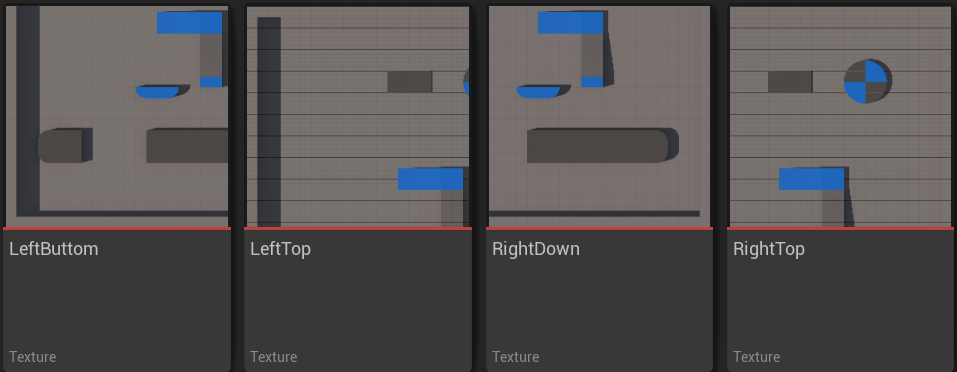
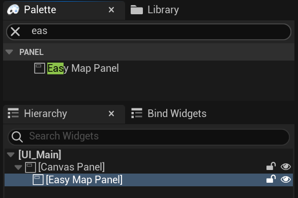
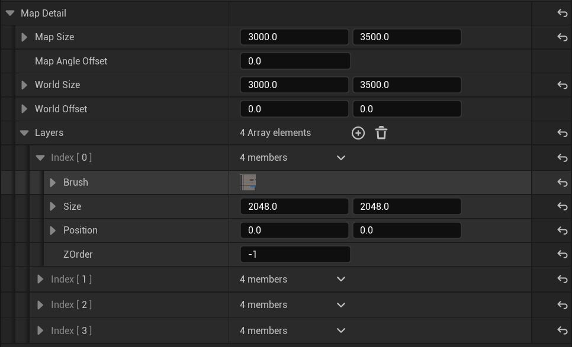
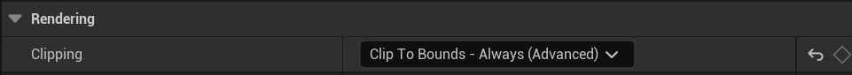
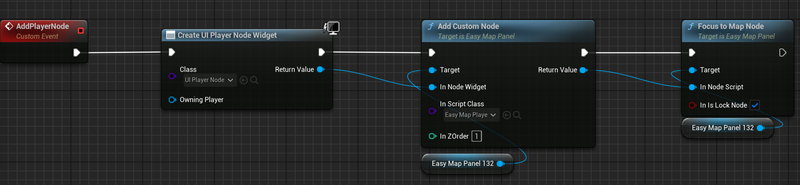
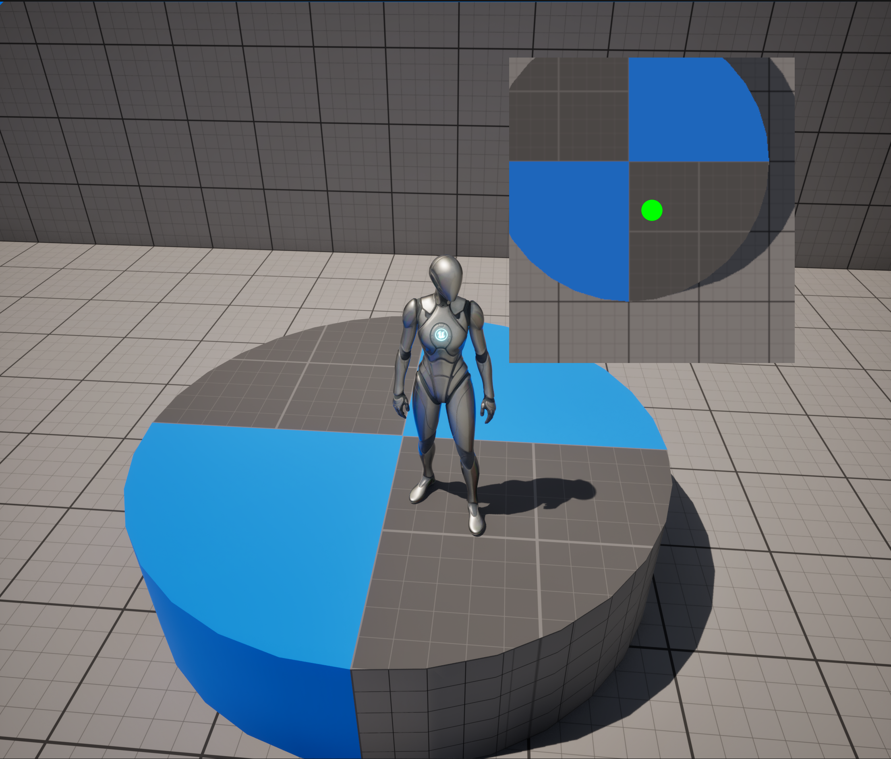

# 简单地图
- 支持多底图拼接
- 支持拖拽，缩放，聚焦，点击，添加自定义标记点
- 封装为 UWidget，直接拖入 UMG 中即可使用

## 快速使用
1. 准备好地图的静态Texture
   

   
   

2. 在 UMG 中拖入 EasyMapPanel
    

   
   

3. 在属性栏中配置好地图信息（实际地图大小，实际地图左上角相对于（0，0，0）的偏移，地图画布大小，底图图片、大小和位置（数组））,这一步也可以通过SetMapDetail函数动态设置
    

   
   

4. 给 EasyMapPanel 设置 Clipping
    

   
   

5. 通过蓝图给 EasyMapPanel 动态挂载标记点
    

   
   

6. 完成
    

   
   

## 其他
- 所有标记点的行为和 UI 均可自定义,所有标记点的行为均由 UEasyMapNodeProxy 控制, 通过继承 UEasyMapNodeProxy 即可实现对应标记点的行为;通过 AddCustomNode 函数将创建的 UI 和 UEasyMapNodeProxy 进行关联。
-  直接将创建的 UI RemoveFromParent 或通过调用 UEasyMapNodeProxy 的 RemoveFromParent() 函数都可以将标记点移除。
